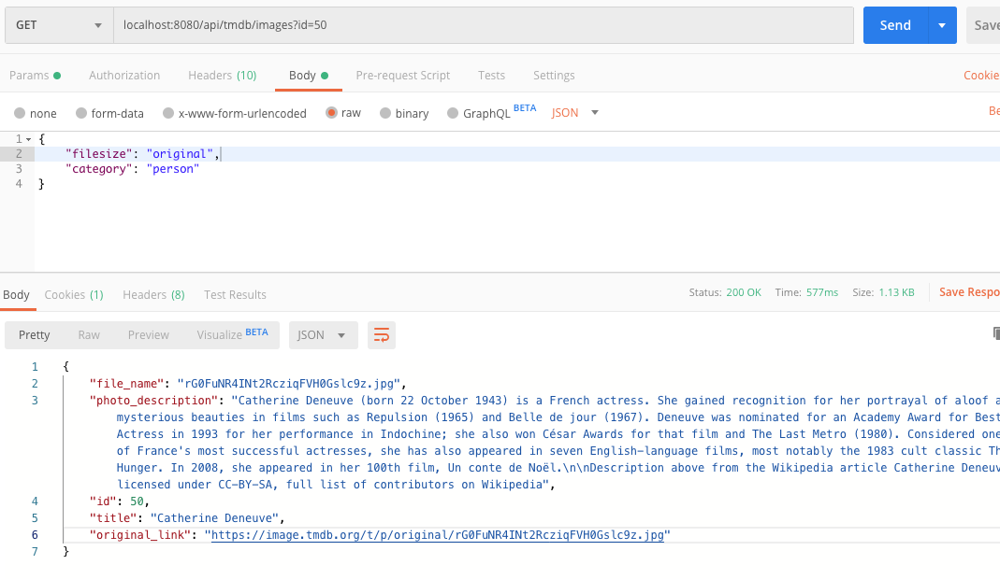
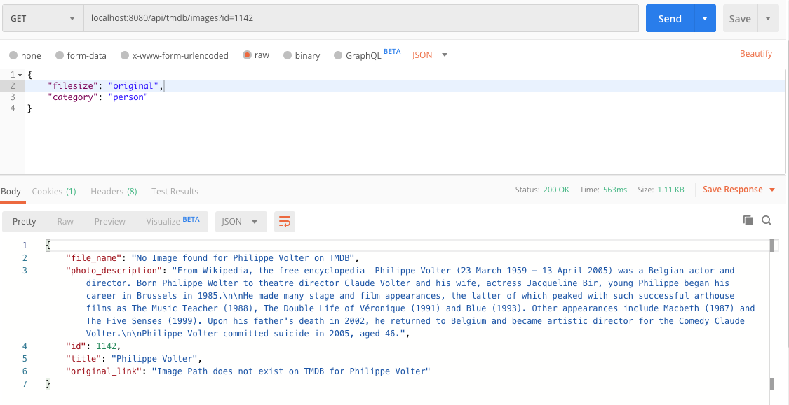
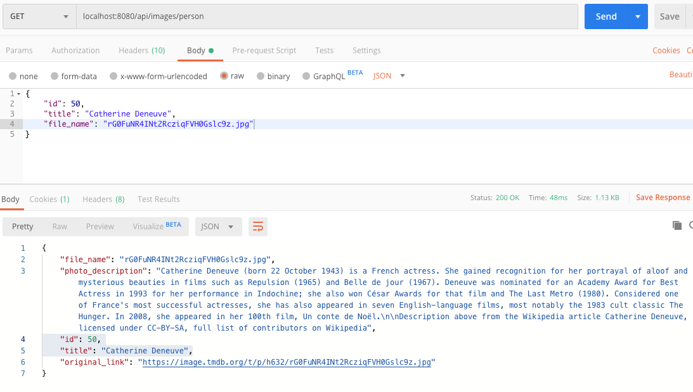
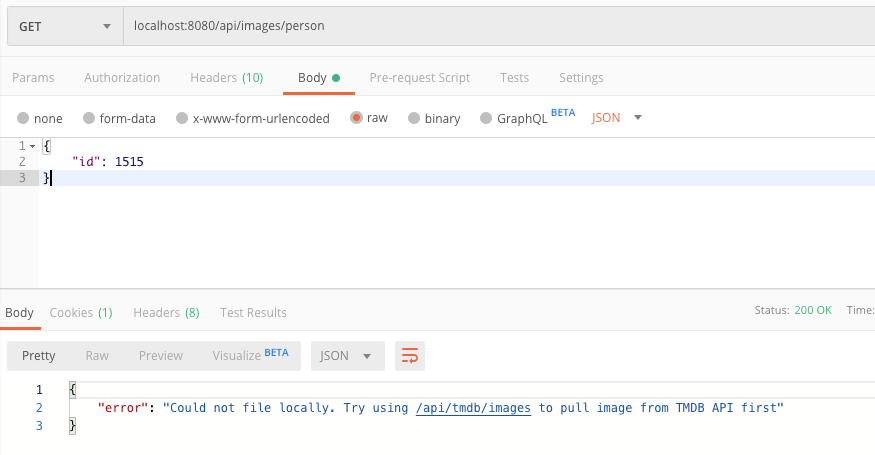
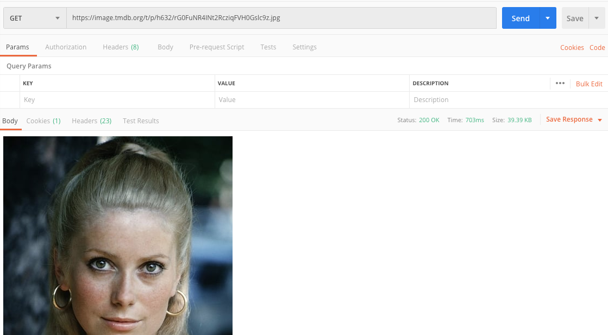
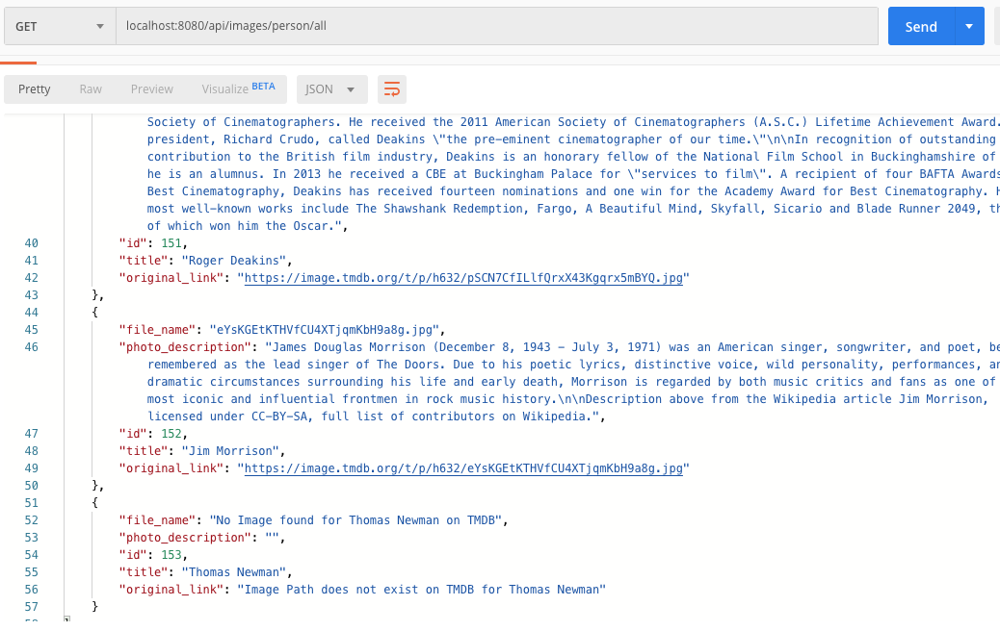

# tmdbMovieAPI :computer: :tada:
Mini Java project that stores and retrieves image details from The Movie DB's API. Developed as part of a coding assignment.

## Contact Info
Nicholas Chin Jie (nicholaschin20@gmail.com)

## 0. Getting Started 
### Setup Maven on your computer
Go to the file path directory. 

    cd /{PATH}/tmdbMovieAPI

First install all relevant dependencies for the application to run.

    mvn clean install

Then run application server locally. 

    mvn spring-boot:run

By default, the application will run on port 8080.

If the mvn command is not supported on your machine, please install here[https://www.baeldung.com/install-maven-on-windows-linux-mac].

### Setting up the Database (for MacOS only)
I used a MongoDB database instance for data storage. 

To run MongoDB manually, issue the following (NOTE: version may be different): 

    brew services start mongodb-community@4.2

Or use this to run it as a background process: 

    mongod --config /usr/local/etc/mongod.conf --fork

If MongoDB has yet to be installed on your respective machine, please follow the instructions here[https://docs.mongodb.com/manual/administration/install-community/] to get the mongod process up and running. 

The MongoDB instance is configured to run on port 27017. Please ensure it is not in use before running the application server. You may also modify the port number in com/example/rm/movieDB/config/AppConfig file. 

## 1. Application Use Case

#### The design criteria for this application was as follows: 
* Use developer API from The Movie DB to retrieve photos and save those photos in your server. You could retrieve any photo you like.

* Keep the title, description, filename and its original link on The Movie DB of each photo in any data format chosen.

* Handle the json query request from a user to query photo name, description, filename and its original link from your data storage.

### Introduction
This app was built using the Spring MVC Framework, which is a great way to build robust scalable API applications whilst reducing boilerplate code in Java. My database of choice was MongoDB given the non-relational nature of the data I retrieved and stored from the Movie API databse (TMDB). I used Postman to test API calls locally.

### Retrieving & Saving Photos 
This API call allows users to retrieve photos from TMDB via an API call involving three **required** fields: *id* (as a query parameter), along with *filesize* and *category* as part of a json query. Upon retrieval, all information is then saved locally into a MongoDB database instance.

#### Example (Success)
Call the **/api/tmdb/images?id={id}** endpoint to GET a response, containing an actor's title, description, file_name, and original_link: 

#### Example (Failed)
However, if the TMDB fails to respond an photo/image link. The API will return: 

#### Supported Fields: 
* **id**: strictly integers only (1 to n)
* **filesize**: {""w45",
            "w185",
            "h632",
            "original"}
* **category**: people

### Querying the Database
A second API endpoint was implemented for local data retrieval. Once an image is saved (as demonstrated above), an API call to TMDB servers is no longer required to retrieve an image and its details. 

Call the **/api/images/person** endpoint to query (search for) any existing image, via *id*, *title* (photo name), *filename*, or *original link* - from your local database.

But of course, if the image wasn't pulled from TMDB earlier, it won't exist in the database either.

#### Supported Query Fields: 
* **id**: int
* **file_name**: string
* **title**: string
* **original_link**: string

### Viewing the Image File 

## 2. Project Architecture
    - src/main/java
        - MainApplication.java 
        - config
            - AppConfig.java
        - db
            - ImageRepository.java
        - model
            - ImageDefaultSchema.java
            - TMDBPersonSchema.java
            - UserExampleRequest.java 
        - controller 
            - ImagesController.java
        - Service
            - MovieImageService.java
            - MovieImageTransformer.java
            - URITemplateService.java

## 3. Further Documentation

### See ALL items in database

### Remove ALL items in database
Hit endpoint **/api/images/person/all/clean**

## 4. Future Improvements
This is by no means a complete work, but simply a demonstration of a simple RESTful API design. Things I could do better include:
* Introducing better error logging and exception handling (e.g what happens if a user submits an unsupported query?)
* Storing API key and key information somewhere more safe! Per open source standards, it's imperative I store them as environment properties and inject them during runtime. 
<!-- * The photo files themselves aren't store locally. All they do is direct users to the image url hosted by TMDB. -->
