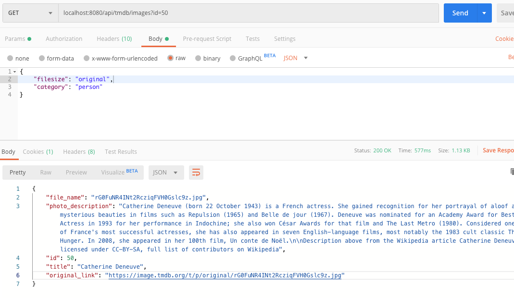

# tmdbMovieAPI :computer: :tada:
Mini Java project that stores and retrieves image details from The Movie DB's API. Developed as part of a coding assignment.

## Contact Info
Nicholas Chin Jie (nicholaschin20@gmail.com)

## 0. Getting Started 
### Setup Maven on your computer
Go to the file path directory. 

    cd /{PATH}/tmdbMovieAPI

First install all relevant dependencies for the application to run.

    mvn clean install

Then run application server locally. 

    mvn spring-boot:run

By default, the application will run on port 8080.

If the mvn command is not supported on your machine, please install here(https://www.baeldung.com/install-maven-on-windows-linux-mac).

### Setting up the Database (for MacOS only)
I used a MongoDB database instance for data storage. 

To run MongoDB manually, issue the following (NOTE: version may be different): 

    brew services start mongodb-community@4.2

Or use this to run it as a background process: 

    mongod --config /usr/local/etc/mongod.conf --fork

If MongoDB has yet to be installed on your respective machine, please follow the instructions here(https://docs.mongodb.com/manual/administration/install-community/) to get the mongod process up and running. 

I've configured the MongoDB instance to run on port 27017. Please ensure it is not in use before running the application server. You may also modify the port number in com/example/rm/movieDB/config/AppConfig file. 

## 1. Application Use Case

### The design criteria for this application was as follows: 
* Use developer API from The Movie DB to retrieve photos and save those photos in your server. You could retrieve any photo you like.

* Keep the title, description, filename and its original link on The Movie DB of each photo in any data format chosen.

* Handle the json query request from a user to query photo name, description, filename and its original link from your data storage.

### Introduction
This app was built using the Spring MVC Framework, which is a great way to build robust scalable API applications whilst reducing boilerplate code in Java. My database of choice was MongoDB given the non-relational nature of the data I retrieved and stored from the Movie API databse (TMDB). I used Postman to test API calls locally.

### Retrieving & Saving Photos (/api/tmdb/images?id={id})
This API call allows users to retrieve photos from TMDB via three **required** fields: *id* (as a query parameter), along with *filesize* and *category* as a json query.

Example 

